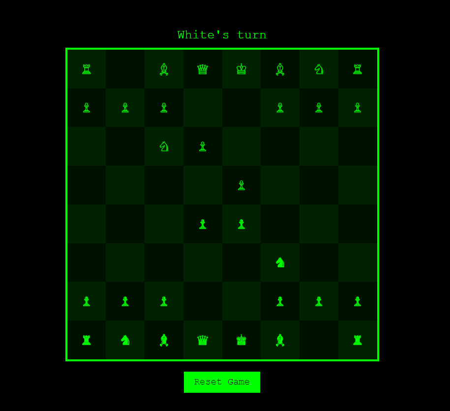

# 8-bit Chess Game

This project is an 8-bit style chess game implemented in HTML, CSS, and JavaScript. It features a responsive design and allows two players to play chess on the same device.

## ✨ Features

- 📱 Responsive 8-bit style chess board
- 👥 Two-player gameplay
- ♟️ Basic chess rules implementation
- 👑 Pawn promotion
- 🔦 Move highlighting

## 🕹️ How to Play
1. Open index.html in your web browser.
2. Two players take turns making moves:
   - 🖱️ Click on a piece to select it.
   - 🎯 Click on a highlighted square to move the selected piece.
3. The game alternates between ⚪ White and ⚫ Black turns.
4. Pawns are automatically promoted to Queens when they reach the opposite end of the board.

## 🚀 Installation
1. Clone this repository
2. Navigate to project directory
3. Open `index.html` in your web browser

## 🛠️ Technologies Used
- HTML
- CSS
- Javascript

## 🔮 Future Improvements
- Implement an AI opponent
- Add castling and en passant moves
- Include a move history feature
- Add sound effects for moves and captures
- Implement a game over screen with restart option

## 🤝 Contributing
- Contributions are welcome! Please feel free to submit a Pull Request.

## 🙏 Credits
- Created with ❤️ by **Aditya Kch**
- Chess piece Unicode characters from Unicode.org
